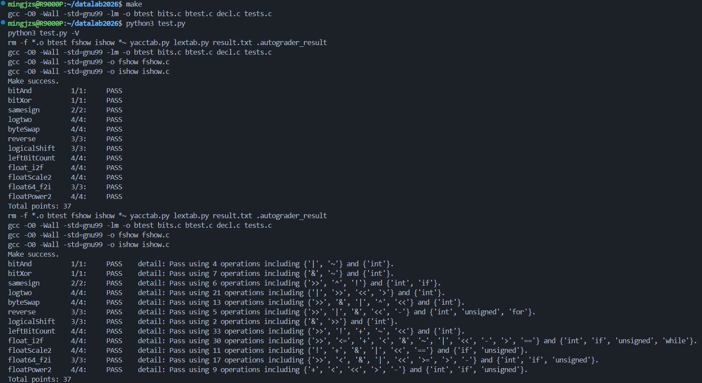

# datalab 报告

姓名：郭泽楷

学号：2025201755

test 截图：

## 解题报告

### 亮点

1. byteSwap
2. leftBitCount

### byteSwap

int byteSwap(int x, int n, int m) {
    int ns = n << 3;
    int ms = m << 3;
    int a = (x >> ns) & 0xff;
    int b = (x >> ms) & 0xff;
    int diff = a ^ b;

    return x ^ (((diff & 0xffffffffu) << ns) |
                ((diff & 0xffffffffu) << ms));
}

先提取第 `n`、`m` 个字节，计算它们的异或值 `diff`。再把 `diff` 移到这两个字节的位置，与原数异或，就能完成交换，其余位保持不变。

### leftBitCount

int leftBitCount(int x) {
    int z = ~x;
    int count = (!(z >> 16)) << 4;

    count = count + (!(z >> (24 + ~count + 1)) << 3);
    count = count + (!(z >> (28 + ~count + 1)) << 2);
    count = count + (!(z >> (30 + ~count + 1)) << 1);
    count = count + !(z >> (31 + ~count + 1));

    return count + !z;
}

将 `x` 取反，问题转化为统计高位连续的 0。依次按 16、8、4、2、1 位缩小范围并累加数量；对原数全为 1 的情况单独补上最后一位。